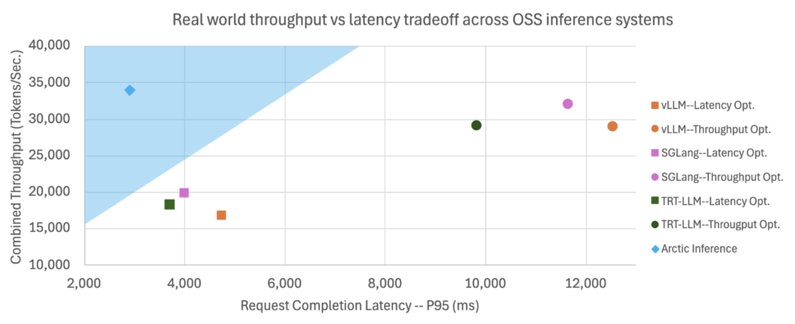
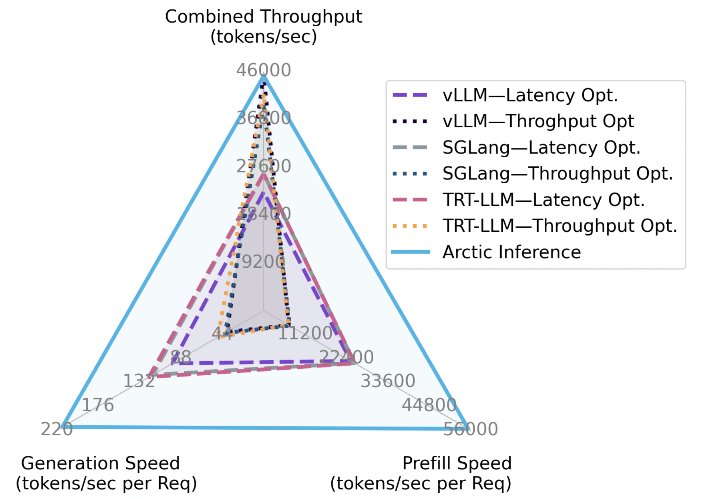
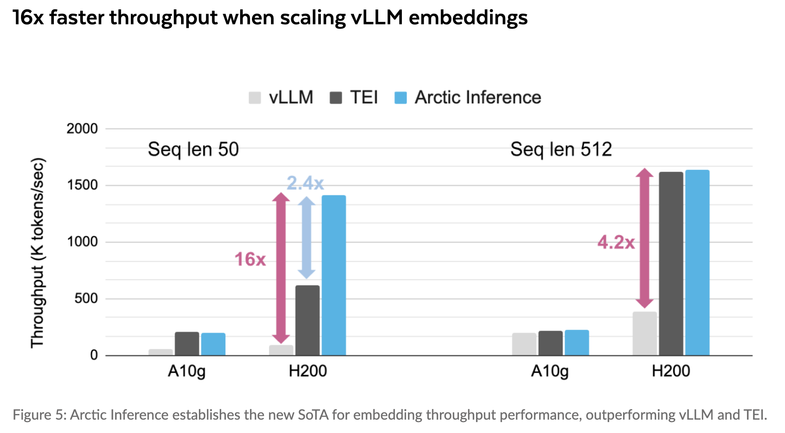

[](https://github.com/snowflakedb/ArcticInference/blob/main/LICENSE)
[](https://pypi.org/project/arctic-inference/)

<h3 align="center">
  <br>
  | <a href="https://arcticinference.readthedocs.io/en/latest/"><b>Documentation</b></a> | <a href="https://www.snowflake.com/en/engineering-blog/arctic-inference-shift-parallelism/"><b>Blog</b></a> |
</h3>

## Latest news
* [2025/05] - [Arctic Inference w. Shift Parallelism: The Fastest Open Source Inference System for Enterprise AI](https://www.snowflake.com/en/engineering-blog/arctic-inference-shift-parallelism/)
* [2025/05] - [Scaling vLLM for Embeddings: 16x Throughput and Cost Reduction](https://www.snowflake.com/en/engineering-blog/embedding-inference-arctic-16x-faster/)
* [2025/05] - [Fastest Speculative Decoding in vLLM with Arctic Inference and Arctic Training](https://www.snowflake.com/en/engineering-blog/fast-speculative-decoding-vllm-arctic/)
* [2025/04] - [Low-Latency and High-Throughput Inference for Long Context w. Sequence Parallelism (Ulysses)](https://www.snowflake.com/en/engineering-blog/ulysses-low-latency-llm-inference/)

# Arctic Inference

<p align="middle">

</p>

Arctic Inference is an open-source vLLM plugin that brings Snowflake’s inference innovations to the community, delivering the fastest and most cost-effective open-source inference for LLMs and Embeddings.

Arctic Inference achieves high throughput and low latency through a wholistic set of inference optimizations:

<div align="center">
<table>
    <thead>
        <tr>
            <th align="center">Advanced Parallelism</th>
            <th align="center">Speculative Decoding</th>
            <th align="center">Model Optimization</th>
            <th align="center">Other Optimizations</th>
        </tr>
    </thead>
    <tbody>
        <tr>
            <td align="left">
                Arctic Ulysses (<a href="https://www.snowflake.com/en/engineering-blog/ulysses-low-latency-llm-inference/">blog</a>)
                <br>
                Shift Parallelism (<a href="https://www.snowflake.com/en/engineering-blog/arctic-inference-shift-parallelism/">blog</a>)
            </td>
            <td align="left">
                Arctic Speculator (<a href="https://www.snowflake.com/en/engineering-blog/fast-speculative-decoding-vllm-arctic/">blog</a>)
                <br>
                Suffix Decoding (<a href="https://www.snowflake.com/en/engineering-blog/fast-speculative-decoding-vllm-arctic/">blog</a>,
                                 <a href="https://arxiv.org/abs/2411.04975">paper</a>)
            </td>
            <td align="left">
                SwiftKV (<a href="https://www.snowflake.com/en/blog/up-to-75-lower-inference-cost-llama-meta-llm/">blog</a>,
                         <a href="https://arxiv.org/abs/2410.03960">paper</a>)
            </td>
            <td align="left">
                Embeddings (<a href="https://www.snowflake.com/en/engineering-blog/embedding-inference-arctic-16x-faster/">blog</a>)
                <br>
                Reasoning (<a href="https://hao-ai-lab.github.io/blogs/dynasor-cot/">blog</a>,
                           <a href="https://arxiv.org/abs/2412.20993">paper</a>)
            </td>
        </tr>
    </tbody>
</table>
</div>

## Optimized LLM Inference

For real-world LLM workloads, a single deployment of Arctic Inference + vLLM achieves:

- 3.4x faster request completion and 1.06x higher throughput compared to the best throughput-optimized deployment (TP=1, DP=8)
- 1.7x higher throughput and 1.28x faster request completion compared to the best latency-optimized deployment (TP=8, DP=1) 

<p align="middle">

</p>

Arctic Inference + vLLM achieves the elusive "trifecta" of quicker response, higher throughput, and faster generation in a single deployment:
- 2.25x faster response time (prefill throughput per request) 
- 1.75x faster generation per request
- SOTA combined throughput

## Optimized Embeddings

<p align="middle">

<br>
See <a href="https://www.snowflake.com/en/engineering-blog/embedding-inference-arctic-16x-faster/">our blog</a> for evaluation details.
</p>

For embeddings, Arctic Inference + vLLM delivers a whopping 1.4M toks/sec per GPU:
- 16x faster than plain vLLM on short sequences and 4.2x faster on long sequences
- 2.4x faster than Text Embeddings Inference (TEI) on short sequences and at parity for long sequences

## Quick Start

```console
$ pip install arctic-inference[vllm]
```

Once installed, Arctic Inference automatically patches vLLM to use Arctic Inference with Shift Parallelism and other optimizations implemented in Arctic Inference, and users can continue to use their familiar vLLM APIs and CLI. It’s easy to get started!

### Running Arctic Inference with vLLM

By using the examples below, you can get benefits from Shift Parallelism, Speculative Decoding, and SwiftKV all at once!

#### Serving

```console
vllm serve Snowflake/Llama-3.1-SwiftKV-8B-Instruct \
    --quantization "fp8" \
    --tensor-parallel-size 1 \
    --ulysses-sequence-parallel-size 2 \
    --enable-shift-parallel \
    --speculative-config '{
        "method": "arctic",
        "model":"Snowflake/Arctic-LSTM-Speculator-Llama-3.1-8B-Instruct",
        "num_speculative_tokens": 3,
        "enable_suffix_decoding": true,
        "disable_by_batch_size": 64
    }'
```

#### Offline

```python
import vllm
from vllm import LLM, SamplingParams

vllm.plugins.load_general_plugins()

llm = LLM(
    model="Snowflake/Llama-3.1-SwiftKV-8B-Instruct",
    quantization="fp8",
    tensor_parallel_size=1,
    ulysses_sequence_parallel_size=2,
    enable_shift_parallel=True,
    speculative_config={
        "method": "arctic",
        "model": "Snowflake/Arctic-LSTM-Speculator-Llama-3.1-8B-Instruct",
        "num_speculative_tokens": 3,
        "enable_suffix_decoding": True,
        "disable_by_batch_size": 64,
    },
)

conversation = [
    {
        "role": "user",
        "content": "Write an essay about the importance of higher education.",
    },
]

sampling_params = SamplingParams(temperature=0.0, max_tokens=800)

outputs = llm.chat(conversation, sampling_params=sampling_params)
```


