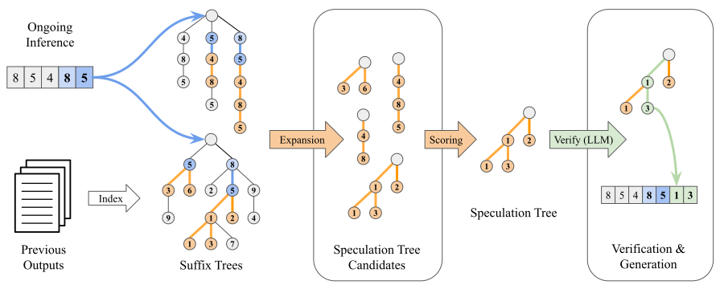

.. _suffix-decoding:

===============
Suffix Decoding
===============

Suffix Decoding is a specialized, model-free speculative decoding method,
optimized to accelerate repetitive and predictable inference workloads typical
in agentic tasks, self-refinement loops, and multi-agent pipelines. This method
employs highly efficient suffix trees, enabling rapid draft token predictions
using CPU resources without GPU overhead.

Core Technique
--------------

Suffix Decoding maintains two distinct suffix trees:

* **Global Suffix Tree**: Contains historical outputs from completed requests,
  capturing common patterns across requests.
* **Per-Request Suffix Tree**: Dynamically constructed during the current
  inference request from its ongoing prompt and generated tokens.

During each inference step, the method:

1. Extracts the most recent sequence of tokens in the request (pattern).
2. Matches this pattern within the suffix trees to quickly identify previously
   observed continuations.
3. Proposes speculative tokens by choosing nodes with the highest frequencies.
4. Dynamically adjusts the number of speculated tokens based on the matched
   pattern length (longer matches mean more aggressive speculations).

  Illustration of suffix decoding showing pattern matching and speculation

Combining with Arctic Speculator
--------------------------------

Suffix decoding can be combined with certain model-based speculation methods
such as :ref:`Arctic Speculator <arctic-speculator>`. In this hybrid mode,
ArcticInference dynamically evaluates the speculation likelihood scores from
suffix decoding against the speculation lengths of the chosen model-based
speculation method, and selects the optimal method for each decoding iteration.
This hybrid approach provides superior performance across both repetitive and
open-ended workloads.

Key Benchmarks
--------------

Suffix decoding has outstanding performance in key benchmarks (vLLM v0.8.4).

.. list-table::
  :header-rows: 1

  * - Workload
    - No Spec
    - N-gram
    - EAGLE
    - Suffix
    - Arctic + Suffix
  * - ShareGPT
    - 76.0 tok/s
    - 91.2 tok/s
    - 102 tok/s
    - 113 tok/s
    - 179 tok/s
  * - HumanEval
    - 77.2 tok/s
    - 100 tok/s
    - 112 tok/s
    - 148 tok/s
    - 217 tok/s
  * - SWE-Bench
    - 75.8 tok/s
    - 175 tok/s
    - Error
    - 286 tok/s
    - 302 tok/s
  * - Mixed
    - 82.9 tok/s
    - 112 tok/s
    - Error
    - 155 tok/s
    - 209 tok/s

Details can be found in our `blog post
<https://www.snowflake.com/en/engineering-blog/fast-speculative-decoding-vllm-arctic/>`_.

Usage Examples
--------------

Minimal configuration for suffix-only decoding (for Llama-3.1-8B-Instruct):

.. code-block:: bash

  vllm serve meta-llama/Llama-3.1-8B-Instruct \
  --speculative-config '{
    "method": "suffix"
  }'

Configuration combining suffix decoding with Arctic Speculator:

.. code-block:: bash

  vllm serve meta-llama/Llama-3.1-8B-Instruct \
  --speculative-config '{
    "method": "arctic",
    "model": "Snowflake/Arctic-LSTM-Speculator-Llama-3.1-8B-Instruct",
    "num_speculative_tokens": 3,
    "enable_suffix_decoding": true
  }'

Configuration Parameters
------------------------

Arctic Inference installs additional parameters to the ``speculative-config``
in vLLM to control suffix decoding behavior, which are listed below.

**Suffix Decoding Parameters:**

* **enable_suffix_decoding** (bool, default: false)
  
  Activates or deactivates suffix decoding. Disabling this completely turns
  off suffix-based speculation.

* **suffix_cache_max_depth** (int, default: 64)
  
  Determines the maximum length of token sequences cached in suffix trees.
  Higher values allow for longer pattern matches and longer speculations at the
  cost of increased memory usage.

* **suffix_max_spec_factor** (float, default: 1.0)
  
  Scales the number of speculative tokens proportionally to the matched pattern
  length. Higher values allow longer speculations with high-confidence matches.
  This is the same as α which controls ``MAX_SPEC`` in the
  `suffix decoding paper <https://arxiv.org/pdf/2411.04975>`_.

* **suffix_max_spec_offset** (float, default: 0.0)
  
  Provides a fixed offset to the speculative length calculation. Negative
  values help control and reduce excessive speculation. The max speculated
  tokens is calculated as:

  ``max_speculated_tokens = suffix_max_spec_factor * matched_length + suffix_max_spec_offset``

* **suffix_min_token_prob** (float, default: 0.1)

  Sets a probability threshold for speculated tokens. Tokens with probabilities
  below this value are discarded, enhancing speculative precision and reducing
  computational waste. Probabilities are calculated based on the frequencies of
  tokens in the suffix trees.
