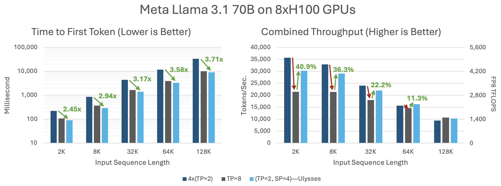
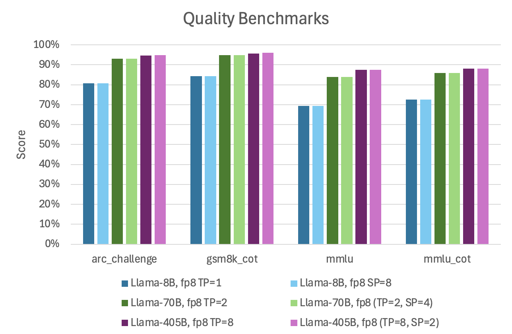

## Arctic Ulysses on vLLM

Ulysses is a form of sequence parallelism (SP) that takes advantage of the latency of tensor parallelism (TP) and throughput of data parallelism (DP) in transformer architecture. We extended vLLM with SP so that the user can select the degrees of TP and SP for low-latency, high-throughput inference.

We compare time-to-first-token and combined throughput of Llama-3.1-70B FP8, running on a DGX box with 8xH100-80GB GPUs. We measured time-to-first-token in a low traffic regime where each request is arriving one at a time, and use a latency-optimized TP baseline using TP=8.  We measured combined-throughput in a high traffic regime, where the arrival rate is high enough to saturate the throughput of the system. We use 4 replicas of TP=2 results using vLLM V1 as our baseline which is capable of achieving high throughput of up to 612 TFlops/GPU, indicating that our baseline is strong. For Arctic Ulysses, we use TP=2, SP=4 for both time-to-first token and combined throughput measurements. For Llama3.3-70B, Arctic Ulysses on a single node (TP=2, SP=4) provides up to 3.71x shorter time-to-first-token (TTFT) than the TP=2 during low traffic baseline and 40.9% higher throughput than the TP=8 baseline during high traffic.



Read more about the details of Ulysses [here].

To confirm the correctness of the Ulysses algorithm, we ran vLLM quality tests with various degrees of TP and SP parallelisms. Since Ulysses does not modify the model architecture but its parallelism, we do obtain similar quality per model basis.



### Running Arctic Ulysses

Run an example conversation using TP=2, SP=2:
```console
$ python offline_inference_ulysses.py

...

The Importance of Higher Education

Higher education is a vital component of an individual's life, providing numerous benefits that extend beyond the acquisition of knowledge and skills. It plays a significant role in shaping an individual's future, career prospects, and overall well-being. In this essay, we will explore the importance of higher education and its far-reaching implications on individuals, society, and the economy.

...
```
